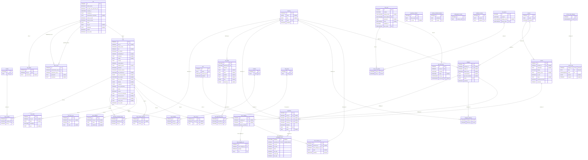

This is the database schema (scroll to zoom, drag to move):

<!-- BEGIN_SQLALCHEMY_DOCS -->

```mermaid
erDiagram
  site {
    INTEGER id PK
    BOOLEAN admin_active
    BOOLEAN all_sites_can_pull_from_me
    DATETIME created_at
    TEXT created_by
    TEXT downstream_comments "nullable"
    BOOLEAN email_on_add
    BOOLEAN email_on_drop
    TEXT name
    TEXT org_url "nullable"
    TEXT password "nullable"
    BOOLEAN private
    BOOLEAN user_active
  }

  country {
    INTEGER id PK
    TEXT code UK
  }

  host {
    INTEGER id PK
    INTEGER site_id FK "nullable"
    BOOLEAN admin_active
    INTEGER asn "nullable"
    BOOLEAN asn_clients
    INTEGER bandwidth_int "nullable"
    TEXT comment "nullable"
    BLOB config "nullable"
    TEXT country
    INTEGER crawl_failures
    TEXT disable_reason "nullable"
    BOOLEAN internet2
    BOOLEAN internet2_clients
    DATETIME last_checked_in "nullable"
    BIGINT last_crawl_duration "nullable"
    DATETIME last_crawled "nullable"
    BLOB last_crawls "nullable"
    FLOAT latitude "nullable"
    FLOAT longitude "nullable"
    INTEGER max_connections
    TEXT name
    BOOLEAN private
    TEXT push_ssh_command "nullable"
    TEXT push_ssh_host "nullable"
    TEXT push_ssh_private_key "nullable"
    TEXT robot_email "nullable"
    BOOLEAN user_active
  }

  directory {
    INTEGER id PK
    BIGINT ctime "nullable"
    BLOB files "nullable"
    TEXT name UK
    BOOLEAN readable
  }

  product {
    INTEGER id PK
    TEXT name UK
    BOOLEAN publiclist
  }

  category {
    INTEGER id PK
    INTEGER product_id FK "nullable"
    INTEGER topdir_id FK "nullable"
    BOOLEAN admin_only "nullable"
    TEXT canonicalhost "nullable"
    TEXT geo_dns_domain "nullable"
    TEXT name UK
    BOOLEAN publiclist
  }

  site_to_site {
    INTEGER id PK
    INTEGER downstream_site_id FK
    INTEGER upstream_site_id FK
    TEXT password "nullable"
    TEXT username "nullable"
  }

  site_admin {
    INTEGER id PK
    INTEGER site_id FK
    TEXT username "nullable"
  }

  host_category {
    INTEGER id PK
    INTEGER category_id FK "nullable"
    INTEGER host_id FK "nullable"
    BOOLEAN always_up2date
  }

  host_category_dir {
    INTEGER id PK
    INTEGER directory_id FK "nullable"
    INTEGER host_category_id FK
    TEXT path "nullable"
    BOOLEAN up2date "indexed"
  }

  category_directory {
    INTEGER category_id PK,FK
    INTEGER directory_id PK,FK
  }

  host_category_url {
    INTEGER id PK
    INTEGER host_category_id FK
    BOOLEAN private
    TEXT url UK
  }

  host_acl_ip {
    INTEGER id PK
    INTEGER host_id FK "nullable"
    TEXT ip UK "nullable"
  }

  host_country_allowed {
    INTEGER id PK
    INTEGER host_id FK "nullable"
    TEXT country UK
  }

  host_netblock {
    INTEGER id PK
    INTEGER host_id FK "nullable"
    TEXT name "nullable"
    TEXT netblock "nullable"
  }

  host_peer_asn {
    INTEGER id PK
    INTEGER host_id FK "nullable"
    INTEGER asn
    TEXT name "nullable"
  }

  host_stats {
    INTEGER id PK
    INTEGER host_id FK "nullable"
    BLOB data "nullable"
    DATETIME timestamp
    TEXT type "nullable"
  }

  arch {
    INTEGER id PK
    TEXT name UK
    BOOLEAN primary_arch
    BOOLEAN publiclist
  }

  version {
    INTEGER id PK
    INTEGER product_id FK "nullable"
    TEXT codename "nullable"
    BOOLEAN display
    TEXT display_name "nullable"
    BOOLEAN is_test
    TEXT name "nullable"
    BOOLEAN ordered_mirrorlist
    INTEGER sortorder
  }

  repository {
    INTEGER id PK
    INTEGER arch_id FK "nullable"
    INTEGER category_id FK "nullable"
    INTEGER directory_id FK "nullable"
    INTEGER version_id FK "nullable"
    BOOLEAN disabled
    TEXT name UK
    TEXT prefix "nullable"
  }

  file_detail {
    INTEGER id PK
    INTEGER directory_id FK
    TEXT filename
    TEXT md5 "nullable"
    TEXT sha1 "nullable"
    TEXT sha256 "nullable"
    TEXT sha512 "nullable"
    BIGINT size "nullable"
    BIGINT timestamp "nullable"
  }

  repository_redirect {
    INTEGER id PK
    TEXT from_repo UK
    TEXT to_repo "nullable"
  }

  country_continent_redirect {
    INTEGER id PK
    TEXT continent
    TEXT country UK
  }

  embargoed_country {
    INTEGER id PK
    TEXT country_code UK
  }

  directory_exclusive_host {
    INTEGER id PK
    INTEGER directory_id FK
    INTEGER host_id FK
  }

  location {
    INTEGER id PK
    TEXT name UK
  }

  host_location {
    INTEGER id PK
    INTEGER host_id FK
    INTEGER location_id FK
  }

  file_group {
    INTEGER id PK
    TEXT name UK
  }

  file_detail_file_group {
    INTEGER id PK
    INTEGER file_detail_id FK
    INTEGER file_group_id FK
  }

  host_country {
    INTEGER id PK
    INTEGER country_id FK
    INTEGER host_id FK
  }

  netblock_country {
    INTEGER id PK
    TEXT country
    TEXT netblock UK
  }

  mm_user_visit {
    INTEGER id PK
    INTEGER user_id FK
    DATETIME created
    DATETIME expiry "nullable"
    VARCHAR(50) user_ip
    VARCHAR(40) visit_key UK "indexed"
  }

  mm_group {
    INTEGER id PK
    DATETIME created
    VARCHAR(255) display_name "nullable"
    VARCHAR(16) group_name UK
  }

  mm_user_group {
    INTEGER group_id PK,FK
    INTEGER user_id PK,FK
  }

  mm_user {
    INTEGER id PK
    DATETIME created
    VARCHAR(255) display_name "nullable"
    VARCHAR(255) email_address UK
    TEXT password "nullable"
    VARCHAR(50) token "nullable"
    DATETIME updated_on
    VARCHAR(16) user_name UK
  }

  access_stat_category {
    INTEGER id PK
    VARCHAR(255) name UK
  }

  access_stat {
    INTEGER category_id PK,FK "indexed"
    DATE date PK "indexed"
    VARCHAR(255) name PK
    FLOAT percent "nullable"
    INTEGER requests "nullable"
  }

  propagation_stat {
    DATETIME datetime PK "indexed"
    INTEGER repository_id PK,FK "nullable,indexed"
    INTEGER no_info
    INTEGER no_info2
    INTEGER older
    INTEGER one_day
    INTEGER same_day
    INTEGER two_day
  }

  site ||--o{ host : site_id
  product ||--o{ category : product_id
  directory ||--o{ category : topdir_id
  site ||--o{ site_to_site : upstream_site_id
  site ||--o{ site_to_site : downstream_site_id
  site ||--o{ site_admin : site_id
  host ||--o{ host_category : host_id
  category ||--o{ host_category : category_id
  host_category ||--o{ host_category_dir : host_category_id
  directory ||--o{ host_category_dir : directory_id
  category ||--o{ category_directory : category_id
  directory ||--o{ category_directory : directory_id
  host_category ||--o{ host_category_url : host_category_id
  host ||--o{ host_acl_ip : host_id
  host ||--o{ host_country_allowed : host_id
  host ||--o{ host_netblock : host_id
  host ||--o{ host_peer_asn : host_id
  host ||--o{ host_stats : host_id
  product ||--o{ version : product_id
  category ||--o{ repository : category_id
  version ||--o{ repository : version_id
  arch ||--o{ repository : arch_id
  directory ||--o{ repository : directory_id
  directory ||--o{ file_detail : directory_id
  directory ||--o{ directory_exclusive_host : directory_id
  host ||--o{ directory_exclusive_host : host_id
  location ||--o{ host_location : location_id
  host ||--o{ host_location : host_id
  file_detail ||--o{ file_detail_file_group : file_detail_id
  file_group ||--o{ file_detail_file_group : file_group_id
  country ||--o{ host_country : country_id
  host ||--o{ host_country : host_id
  mm_user ||--o{ mm_user_visit : user_id
  mm_user ||--o{ mm_user_group : user_id
  mm_group ||--o{ mm_user_group : group_id
  access_stat_category ||--o{ access_stat : category_id
  repository ||--o{ propagation_stat : repository_id

```
<!-- END_SQLALCHEMY_DOCS -->
